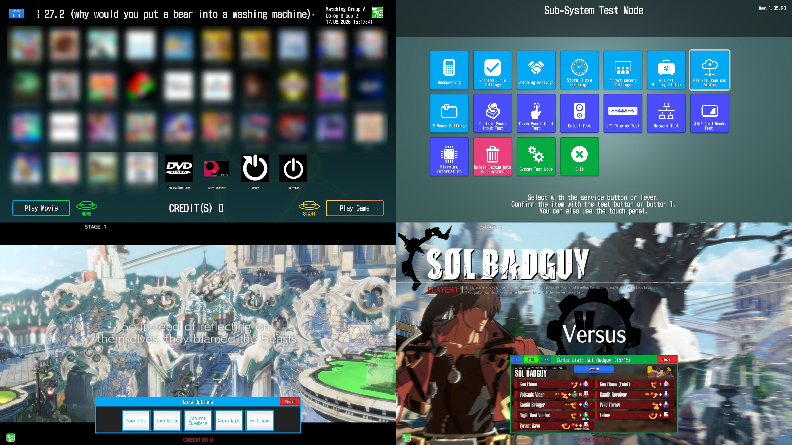

# APMExtensions

Why settle for third party launchers when you can just use the official one?

2024-2026 Haruka

Code licensed under the GPLv3. Text licensed under the Creative Commons Attribution-NonCommercial-ShareAlike 4.0
International.

------

## Setup

Head to the [Wiki](https://github.com/akechi-haruka/APMExtensions/wiki).

## Features

### APMCoreFixes

* Disable checks for file names and .opt files
* Add a clock
* Show mouse cursor
* Send the server the list of games installed (so it can return the "allowed" status for all of them)
* Add support for an analog IO4 device, see wiki for extra instructions.
* Skip Japan warning
* Use root directory instead of App directory for launched games. See wiki for extra instructions.

### APMHeadbanana

Replacement DLL to make APM headphone controls customizable.

By default, replacing apmHeadphoneVolume.dll with no further configuration will make the headphone volume slider in
Apmv3System and emoneyUI adjust the main left/right speaker volume.

### APMHeadbananaLink

Allows setting the audio channels that APMHeadbanana changes.

### emouneyUIFixes

* Shrinks the hitbox for the buttons
* Add primary speaker controls
* Allow exiting non-APM games
* Add in-game guides and menus. See wiki for extra instructions.

### EXMoney

Integrates eMoneyUI into non-APM games.

This requires the game to run in windowed/borderless.

See wiki for extra instructions.

## Building

The project can be built using `dotnet build` or any IDE that has C# integration.

### Requirements

* .NET Framework 4.8.1 SDK, .NET 10 SDK, MSVC v145 or higher, Windows 10 SDK 10.0.26100.0 or higher.
* The latest version of [BepInEx 5](https://github.com/BepInEx/BepInEx/releases) placed in `Libs\bepinex`.
* All .dll files from APMv3System's `APMv3System_Data\Managed` folder (SDEM 1.05.90) placed in `Libs\apm`
    * A "publicized" version of `Assembly-CSharp.dll` is required, which can be obtained by
      running [NStrip](https://github.com/bbepis/NStrip) with `nstrip.exe -p -cg Assembly-CSharp.dll`
* All .dll files from APMv3System's `EMoneyUI_Data\Managed` folder (SDEM 1.05.90) placed in `Libs\emui`
    * A "publicized" version of `Assembly-CSharp.dll` is required, which can be obtained by
      running [NStrip](https://github.com/bbepis/NStrip) with `nstrip.exe -p -cg Assembly-CSharp.dll`
